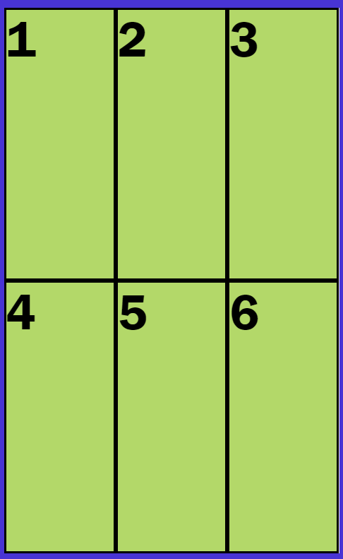

# Coding examples


## CSS - GRID

### CSS - Grid: Items in fixed number of same width columns
Items are put in 3 columns, each 1fr wide.

```css
display: grid;
grid-template-columns: repeat(3, 1fr);
```

**Narrow screen**: Items are in 3 narrow columns



**Wide screen**: Items are in 3 wide columns  


### CSS - Grid: Items in fixed number of different width columns
Items are put in 2 columns, 1st column twice the width 

```css
display: grid;
grid-template-columns: 2fr 1fr;
```

**Narrow screen**: Items are in 2 narrow columns, 1st column twice the width


**Wide screen**: Items are in 2 wide columns, 1st column twice the width


### CSS - Grid - Auto-fit: Dynamically place items to columns, based on screen size
Item takes min. 100px and max 1fr.

```css
display: grid;
grid-template-columns: repeat(auto-fit, minmax(100px, 1fr));
```
**Narrow screen**: Puts items on another row(s)


**Wide screen**: If fit on one row, they expand as much as they can


### CSS - Grid - Auto-fill: Dynamically place items and blank items to columns, based on screen size.
Items take 100px. 

**Narrow screen**: Puts items on another row(s)


**Wide screen**: If items fit on one row, they expand only to 100px. New empty 100px items are added to the end.

 

```css
display: grid;
grid-template-columns: repeat(auto-fill, 100px);
```
Narrow screen:


Wide screen (DevTools only shows lines of empty items, in normal mode they are not visible): 


| Left | Center | Right |
| :--- | :----: | ----: |
| 1    |   2    |     3 |
| 30   |   40   |    50 |
 
